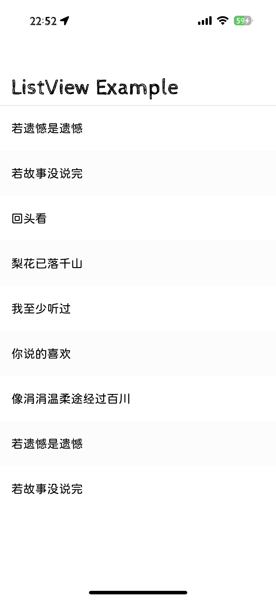

# ListViewKit

A modern, glitch-free UITableView replacement for Swift + UIKit.



## Features

- 🌀 **No Glitch on contentSize Change**: Instantly adapts to content size changes without any visual glitches
- 🛡️ **Smooth Scrolling**: User scrolling remains perfectly smooth, even during data updates
- 🔄 **Live Data Refresh**: Data source can be updated at any time, with immediate and safe UI refresh
- 📦 **Swift Package Manager**: Easy to integrate into your project using SPM

## Installation

Add the following to your `Package.swift` file:

```swift
dependencies: [
    .package(url: "https://github.com/Lakr233/ListViewKit", from: "0.1.0"),
]
```

Platform compatibility:

- iOS 13.0+
- macCatalyst 13.0+

## Usage

1. **Define your ViewModel**

```swift
struct ViewModel: Identifiable, Hashable {
    var id: UUID = .init()
    var text: String = ""
    enum RowKind: Hashable {
        case text
    }
}
```

2. **Create ListView and set up Diffable Data Source**

```swift
let listView = ListView(frame: .zero)
let dataSource: ListViewDiffableDataSource<ViewModel> = .init(listView: listView)
```

3. **Apply your data**

```swift
var snapshot = dataSource.snapshot()
snapshot.append(ViewModel(text: "Hello ListViewKit"))
dataSource.applySnapshot(snapshot, animatingDifferences: true)
```

## License

This project is licensed under the MIT License. See the [LICENSE](./LICENSE) file for details.

---

Copyright 2025 © Lakr233 & FlowDown Team. All rights reserved.
