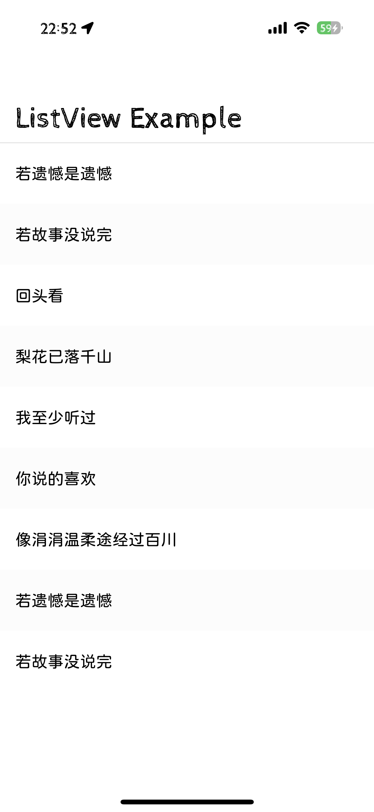

# ListViewKit

[](https://github.com/Lakr233/ListViewKit/actions/workflows/ci.yml)

A lightweight, diffable, reusing list view for Swift, UIKit, and AppKit.



Rows are measured only when they are needed. Everything else is corrected in
slices between frames, so opening a list, appending to it, and resizing it cost
about the same whether it holds ten rows or a hundred thousand.

## Requirements

- Swift 6.0+
- iOS 17.0+ / macCatalyst 17.0+ / macOS 14.0+
- No dependencies beyond two small animation packages.

## Installation

```swift
dependencies: [
    .package(url: "https://github.com/Lakr233/ListViewKit", from: "3.0.0"),
]
```

## Usage

A list owns its content. Declare the row types once, then hand it arrays.

```swift
struct Message: Identifiable, Hashable {
    let id: UUID
    var text: String
}

let list = ListView<Message>()

list.rows {
    ListRow(TextRow.self)
        .height { message, context in
            TextRow.height(for: message.text, width: context.width)
        }
        .configure { row, message, _ in
            row.show(message.text)
        }
}

list.apply(messages)
```

`TextRow` is your own `ListRowView` subclass. That is the whole setup: one
object, nothing to keep alive on the side.

### Several row types

Registrations are tried in declaration order and the first `when` match claims
the item, so the unconditional one goes last.

```swift
list.rows {
    ListRow(ImageRow.self)
        .when(\.isImage)
        .estimatedHeight(220)
        .height { message, context in message.aspectHeight(for: context.width) }
        .configure { row, message, _ in row.show(message.image) }

    ListRow(TextRow.self)
        .height { message, context in
            TextRow.height(for: message.text, width: context.width)
        }
        .configure { row, message, _ in row.show(message.text) }
}
```

### Changing the content

```swift
list.apply(messages, animated: true)  // replace everything, diffed
list.append(message)                  // add to the end, O(log n)
list.update(message)                  // one item changed, no diff
```

`apply` has to compare the whole array to find out what moved, which is O(n)
per call however little changed. For a chat client adding one message, use
`append`; for a streaming response rewriting one message, use `update`. Both
leave every other row untouched.

Items need unique, stable identifiers. Changing an item's hashable value is
what marks its row for refilling and re-measuring.

### Rows

Subclass `ListRowView` and clear transient state in `prepareForReuse`:

```swift
final class TextRow: ListRowView {
    override func prepareForReuse() {
        super.prepareForReuse()
        imageTask?.cancel()
        imageTask = nil
        label.text = nil
    }
}
```

It is called before every configuration, including the first, so it must be
idempotent.

### Auto Layout

The list writes `row.frame` and never reads a row's intrinsic size. Using Auto
Layout *inside* a row is fine — the list hands over a definite `bounds` to lay
out within.

A row registered **without** a `height` closure is measured from its own
constraints instead, on one hidden prototype per row type:

```swift
ListRow(CardRow.self)
    .estimatedHeight(80)
    .configure { row, item, context in
        row.title.text = item.title            // affects height
        guard context.purpose == .display else { return }
        row.avatar.load(item.avatarURL)        // does not
    }
```

Check `context.purpose` for anything that is not height: a full measurement
pass would otherwise fire one image request per row in the list.

Self-sizing costs one to two orders of magnitude more per row than a height
closure, so the scrollbar proportion converges as measurement catches up.
Prefer a height closure for lists in the thousands.

### Estimates

Until a row is measured it stands at `estimatedRowHeight` (44 by default), or
whatever its registration declared. Only the content height and the scroller
proportion depend on it, and only until measurement catches up — but a value
near the truth keeps the scroller steady.

### Invalidating a row

When hosted or expandable content changes size without the item changing:

```swift
list.invalidateLayout(forRowWith: message.id)
```

Use `invalidateLayout()` only when every height may have changed, such as
after replacing global typography.

### Following streaming content

```swift
let shouldFollow = list.isScrolledToBottom(tolerance: 4)
list.append(message)

if shouldFollow, !list.isUserInteractingWithScroll {
    list.scrollToBottom(animated: false)
}
```

`isUserInteractingWithScroll` includes platform momentum but excludes
programmatic spring scrolling.

### Scrolling to a row

```swift
list.scrollToRow(at: 20, at: .middle)
list.scrollToRow(with: message.id, at: .nearest)
list.scrollToBottom()
```

## Migrating from 2.x

| 2.x | 3.0 |
| --- | --- |
| `ListView` + `ListViewDiffableDataSource` + adapter | `ListView<Item>` |
| `ListViewAdapter` / `ListViewTypedAdapter` | `list.rows { ListRow(…) }` |
| `ListViewDataSourceSnapshot` | your own `[Item]` |
| `dataSource.applySnapshot(_:animatingDifferences:)` | `list.apply(_:animated:)` |
| `dataSource.updateItem(_:)` | `list.update(_:)` |
| appending via a snapshot | `list.append(_:)` |
| `listView.rowView(at:)` | `list.rowView(for: id)` |
| `invalidateLayout(forRowWithID:)` | `invalidateLayout(forRowWith:)` |
| `ScrollPosition.none` | `ListRowPosition.nearest` |
| `deferredSizeCalculation` | removed; slicing is the only model |
| `AnimationBlockView` | removed; add the list as a subview directly |

The row-kind type is gone. Where you switched on a kind, register one
`ListRow` per row type and select with `when`.

## Tests

```bash
swift test
```

## Benchmarks

```bash
swift run -c release ListViewKitBenchmarks
```

`LVK_ITEMS` and `LVK_BENCH` narrow a run to one size or one path. See
[`Benchmarks/README.md`](./Benchmarks/README.md).

Measured on an Apple Silicon Mac, Release, 800×600 viewport, 100,000 rows:

| | 2.x | 3.0 |
| --- | ---: | ---: |
| Initial layout | 362 ms | 42 ms |
| 20k visible-range queries | 11.8 ms | 3.0 ms |
| 20k content-offset writes | 503 ms | 21 ms |
| 1k tail item updates | 33.7 ms | 9.7 ms |
| Appending one row | 225 ms | 0.03 ms |
| Width reflow | 152 ms | 4.9 ms |

## Examples

- `Example/ListExample`: UIKit.
- `Example/ListExampleMac`: AppKit, as a Swift package.

## License

ListViewKit is available under the MIT License. See [LICENSE](./LICENSE).

---

Copyright 2025 © Lakr233 & FlowDown Team. All rights reserved.
